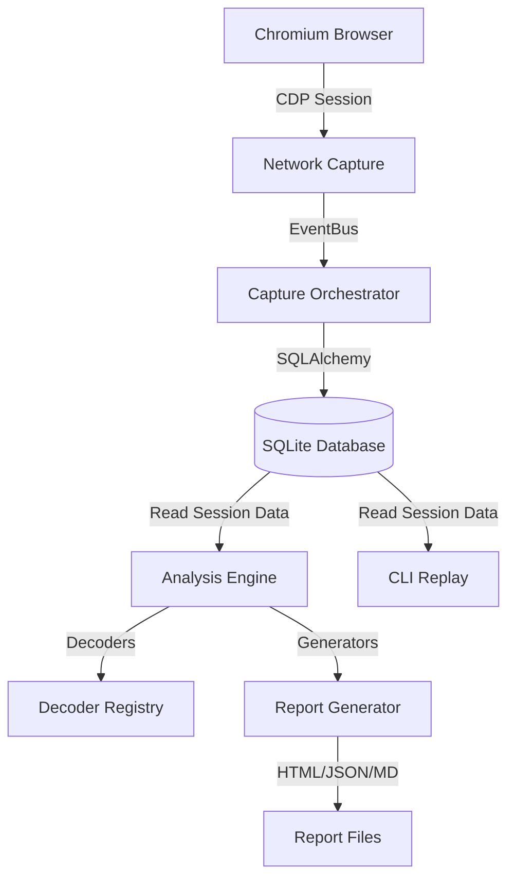

# Wiretap Architecture

Wiretap is structured to separate concerns cleanly between the capturing system, the storage layer, the data decoders, and the analysis/presentation interface.

## Core Modules

1. **`wiretap/core`**: 
   - Defines the immutable domain models (`CaptureSession`, `Connection`, `Frame`, `Payload`, `DecoderResult`, `Annotation`, `ProtocolEvent`).
   - Declares common enums (`Direction`, `ProtocolType`, `EventType`, `DecoderStatus`).
   - Hosts the `EventBus` for decoupling message capture from storage.

2. **`wiretap/capture`**:
   - `BrowserManager`: Manages the Playwright process and Chromium instance. Supports ephemeral or persistent (profile-backed) contexts.
   - `NetworkCapture`: Hooks directly into raw Chrome DevTools Protocol (CDP) `Network` and `Fetch` domains. Listens to `Network.requestWillBeSent`, `Network.responseReceived`, `Network.webSocketFrame*`, and `Network.eventSourceMessageReceived` to construct captured objects.
   - `CaptureOrchestrator`: Drives navigation, tracks run state, and coordinates saving incoming frames to the database.

3. **`wiretap/storage`**:
   - Database layer using SQLAlchemy 2.0 and `aiosqlite` for non-blocking I/O.
   - Tables maps cleanly to core domain models.
   - Includes automatic SHA256-based deduplication of payload contents.

4. **`wiretap/decoders`**:
   - Extensible decoder registry matching the Strategy pattern.
   - Discovers built-in and external decoders dynamically via entry points.
   - Decodes standard formats (JSON, XML, UTF-8/16), compression encodings (Gzip, Zlib, Brotli), and binary protocol serializations (MessagePack, CBOR, Protobuf, FlatBuffers).

5. **`wiretap/analysis`**:
   - `ProtocolDiscovery`: Run statistical heuristics on timestamps and patterns to detect heartbeats, session establishment, request-response pairing, and streaming.
   - `StatisticsEngine`: Summarizes data throughput, protocol distribution, and latency.

6. **`wiretap/visualization`**:
   - Produces standalone interactive dashboards (timeline, connection graph, and payload explorer) utilizing vanilla JS, SVG, and HTML5 canvas.
