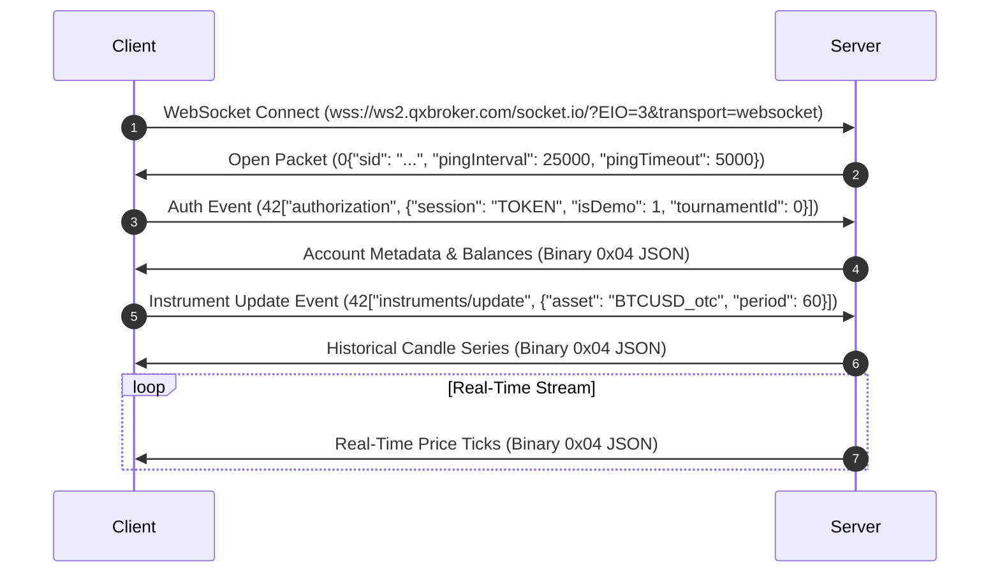

# Quotex Protocol Specification (v1.0)

This document specifies the communication protocol between the Quotex browser client and the backend servers (`wss://ws2.qxbroker.com/socket.io/`). Every detail in this specification is evidence-based and verified via live traffic capture session analysis.

---

## 1. Network Handshake & Transport

Quotex utilizes the **Engine.IO v3** transport protocol over WebSockets. The connection is established directly over WebSockets without requiring HTTP long-polling negotiation.

### WebSocket Connection URL
```text
wss://ws2.qxbroker.com/socket.io/?EIO=3&transport=websocket
```
*   `EIO=3`: Specifies Engine.IO version 3 protocol.
*   `transport=websocket`: Forces direct WebSocket transport mode.

---

## 2. Message Packaging Format

Engine.IO/Socket.IO packets are wrapped using specific character or byte prefixes that define their purpose and framing mode.

### 2.1 Packet Prefixes
*   `0` (Engine.IO `open`): Received from the server upon initial connection. Contains a JSON payload with connection parameters.
*   `2` (Engine.IO `ping`): Keep-alive frame sent to verify connectivity.
*   `3` (Engine.IO `pong`): Keep-alive response frame.
*   `4` (Engine.IO `message`): General data frame containing payload text.
*   `42` (Socket.IO `event`): Standard text message indicating a named Socket.IO event, formatted as a JSON array: `42["eventName", {payload_object}]`.
*   `0x04` (Engine.IO Binary `message`): Binary data frame wrapping a UTF-8 text JSON payload. (Note: The first byte is the byte `0x04`, followed directly by the UTF-8 JSON characters).

---

## 3. Connection & Authentication Flow



### 3.1 Initial Open Packet (0)
Upon connection, the server immediately sends a connection session wrapper:
```json
0{"sid":"Ro_f1IUwpfBIwJ0aBOSd","upgrades":[],"pingInterval":25000,"pingTimeout":5000}
```
*   `sid`: Connection session identifier.
*   `pingInterval`: Keep-alive interval in milliseconds (default: 25,000ms).
*   `pingTimeout`: Keep-alive timeout in milliseconds (default: 5,000ms).

### 3.2 Authorization (42["authorization", ...])
The client must authenticate within the `pingTimeout` window by sending a JSON array event over Socket.IO:
```json
42["authorization",{"session":"ePLLisUSxIL1V0KrKOVhwtzEVzYuhDshZhtBiHRU","isDemo":1,"tournamentId":0}]
```
*   `session`: The session token. This token can be:
    *   Acquired directly from browser cookies/localStorage.
    *   Retrieved via authenticated GET request to `https://qxbroker.com/api/v1/cabinets/digest` under the JSON path `data.token`.
*   `isDemo`: Integer boolean (`1` for demo account, `0` for live trading).
*   `tournamentId`: Integer (`0` for default account).

---

## 4. Keep-Alive (Heartbeat)

To prevent connection termination:
*   The client must monitor the connection state.
*   Every `pingInterval` (25 seconds), a ping frame is sent/received.
*   Depending on the Engine.IO v3 configuration, the client sends a `2` packet and expects a `3` packet in response, or vice versa. In native implementations, the WebSocket-level ping/pong is handled automatically, but protocol-level `"2"` text frames must be responded to with `"3"`.

---

## 5. Subscription & Asset Streaming

### 5.1 Subscribing to an Asset
To subscribe to real-time price updates, the client sends an `"instruments/update"` event:
```json
42["instruments/update",{"asset":"BTCUSD_otc","period":60}]
```
*   `asset`: The unique asset code (e.g., `"BTCUSD_otc"`, `"EURUSD_otc"`, `"ATOUSD_otc"`).
*   `period`: Chart candlestick granularity in seconds (always `60`).

### 5.2 Real-Time Price Ticks
Once subscribed, the server broadcasts real-time ticks wrapped in an Engine.IO binary message (prefix `0x04`) containing a JSON array:
```json
[["ATOUSD_otc",1782829846.783,1.4295,0]]
```
*   **Index 0 (String)**: Asset code (`"ATOUSD_otc"`).
*   **Index 1 (Float)**: High-resolution Unix timestamp with millisecond precision (e.g. `1782829846.783`).
*   **Index 2 (Float)**: Raw market price (e.g. `1.4295`).
*   **Index 3 (Integer)**: Direction flag (`0` for down/red tick, `1` for up/green tick).

---

## 6. Known Unknowns & Future Enhancements

*   **Binary Frame Noise**: Small numbers of binary frames (e.g., prefix `0x8950` - PNG images, `0x3c73` - SVG images) are received occasionally. These represent chart assets and interface assets and can be safely ignored by the tick streaming client.
*   **Session Token Rotation**: The lifespan of the session token retrieved from `https://qxbroker.com/api/v1/cabinets/digest` is tied to the user's web session. A mechanism for token refreshing or automatic renewal through cookies must be established.
